# ĐẶC TẢ YÊU CẦU VÀ MÔ HÌNH UML
# NỀN TẢNG BÁN NÔNG SẢN ĐA NỀN TẢNG TÍCH HỢP TRUY XUẤT NGUỒN GỐC

> **Tên đề tài:** Xây dựng nền tảng bán nông sản đa nền tảng tích hợp truy xuất nguồn gốc  
> **Thành phần hệ thống:** Mobile khách hàng + Web khách hàng + Web quản lý + Backend dùng chung  
> **Mục đích tài liệu:** Xác định Actor, yêu cầu chức năng, yêu cầu phi chức năng và các biểu đồ UML chính phục vụ phân tích – thiết kế hệ thống.
>
> **Quy ước Actor:** Tài liệu này sử dụng đúng 03 Actor nghiệp vụ chính: **Khách hàng – Nhân viên – Admin**. Các vị trí như kho, kiểm định, CSKH, tài chính... là nhóm quyền của Nhân viên thông qua RBAC; Nhà cung cấp/Trang trại là đối tượng nghiệp vụ, không phải Actor đăng nhập.

---

# 1. PHẠM VI HỆ THỐNG

Hệ thống hướng đến một nền tảng bán nông sản/hữu cơ có khả năng quản lý xuyên suốt từ nguồn cung đến người mua:

```text
Nhà cung cấp
    ↓
Trang trại
    ↓
Mùa vụ / Nhật ký canh tác
    ↓
Thu hoạch
    ↓
Lô sản phẩm
    ↓
Kiểm định
    ↓
Chứng nhận
    ↓
Kho / Tồn kho
    ↓
Sản phẩm
    ↓
Giỏ hàng
    ↓
Đặt hàng
    ↓
Thanh toán
    ↓
Giao hàng
    ↓
Khách hàng
    ↓
Đánh giá / Khiếu nại / Hoàn tiền
```

Hệ thống không chỉ quản lý bán hàng mà còn phải bảo đảm mỗi sản phẩm đã bán có thể truy ngược về:

```text
Đơn hàng
→ Chi tiết đơn hàng
→ Lô sản phẩm
→ Thu hoạch
→ Mùa vụ
→ Trang trại
```

---


# 2. XÁC ĐỊNH CÁC ACTOR

## 2.1. Danh sách Actor chính

Hệ thống chỉ sử dụng **03 Actor nghiệp vụ chính**:

| Mã | Actor | Giao diện | Mô tả |
|---|---|---|---|
| ACT-01 | Khách hàng | Mobile khách hàng, Web khách hàng | Tìm kiếm, mua nông sản, truy xuất nguồn gốc, thanh toán, theo dõi đơn, đánh giá và khiếu nại |
| ACT-02 | Nhân viên | Web quản lý | Thực hiện nghiệp vụ vận hành theo quyền được cấp: nguồn cung, trang trại, mùa vụ, lô, kiểm định, kho, đơn hàng, CSKH, tài chính... |
| ACT-03 | Admin | Web quản lý | Quản trị toàn bộ hệ thống, quản lý tài khoản nhân viên, phân quyền, cấu hình, giám sát và báo cáo |

### 2.1.1. Cách xử lý các chức danh nhân viên

Không tách:

```text
Nhân viên kho
Nhân viên kiểm định
Nhân viên xử lý đơn
Nhân viên chăm sóc khách hàng
Nhân viên tài chính
```

thành các Actor riêng.

Tất cả được gom vào Actor:

```text
NHÂN VIÊN
```

và phân quyền bằng:

```text
RBAC
Role
Permission
```

Ví dụ:

```text
Nhân viên A:
- Quyền quản lý kho
- Quyền điều chỉnh tồn kho

Nhân viên B:
- Quyền kiểm định lô
- Quyền xác minh chứng nhận

Nhân viên C:
- Quyền xử lý đơn
- Quyền xử lý khiếu nại
```

### 2.1.2. Nhà cung cấp/Trang trại

Trong phạm vi đồ án hiện tại, **Nhà cung cấp/Chủ trang trại không có tài khoản riêng để đăng nhập**.

Nhà cung cấp là **đối tượng nghiệp vụ** do Nhân viên hoặc Admin quản lý:

```text
Nhân viên/Admin
      ↓
Tạo hồ sơ nhà cung cấp
      ↓
Tạo trang trại
      ↓
Quản lý chứng nhận
      ↓
Quản lý mùa vụ
      ↓
Quản lý nguồn hàng
```

Nếu sau này hệ thống mở rộng để chủ trang trại tự đăng nhập, có thể bổ sung Actor thứ 4 là Nhà cung cấp.

### 2.1.3. Các dịch vụ bên ngoài

Các thành phần như:

```text
Payment Gateway
Đơn vị giao hàng
Push Notification Service
AI Service
```

là **hệ thống/dịch vụ tích hợp**, không tính là Actor nghiệp vụ chính.


# 3. QUYỀN HẠN CỦA TỪNG ACTOR

## 3.1. Khách hàng

Khách hàng sử dụng cùng một tài khoản trên **Mobile khách hàng** và **Web khách hàng**.

Khi chưa đăng nhập, khách hàng có thể:

- xem trang chủ;
- xem danh mục;
- tìm kiếm sản phẩm;
- xem chi tiết sản phẩm;
- xem trang trại;
- xem thông tin truy xuất nguồn gốc công khai;
- đăng ký;
- đăng nhập.

Sau khi đăng nhập, khách hàng có thể:

- quản lý hồ sơ;
- quản lý địa chỉ;
- tìm kiếm và lọc sản phẩm;
- xem sản phẩm;
- xem trang trại;
- xem chứng nhận;
- scan QR Code trên Mobile;
- nhập mã truy xuất trên Web;
- xem truy xuất nguồn gốc;
- thêm/cập nhật giỏ hàng;
- đồng bộ giỏ hàng giữa Mobile và Web;
- áp dụng voucher;
- sử dụng điểm thưởng;
- đặt hàng;
- thanh toán;
- theo dõi đơn;
- theo dõi giao hàng;
- hủy đơn nếu đủ điều kiện;
- lưu sản phẩm yêu thích;
- theo dõi trang trại;
- đánh giá;
- gửi khiếu nại;
- yêu cầu đổi hàng/hoàn tiền;
- nhận thông báo.

Khách hàng không được truy cập các chức năng quản lý nội bộ.

---

## 3.2. Nhân viên

Nhân viên sử dụng **Web quản lý**.

Mỗi nhân viên chỉ được thực hiện chức năng theo **Role/Permission** do Admin cấp.

### Nhóm quyền nguồn cung

- quản lý hồ sơ nhà cung cấp;
- quản lý trang trại;
- quản lý chứng nhận;
- quản lý mùa vụ;
- quản lý nhật ký canh tác;
- ghi nhận thu hoạch;
- tạo/quản lý lô sản phẩm;
- quản lý sản phẩm.

### Nhóm quyền kiểm định

- xem lô chờ kiểm định;
- tạo phiếu kiểm định;
- ghi kết quả;
- tạm giữ lô;
- xác minh/từ chối chứng nhận;
- đề xuất thu hồi lô.

### Nhóm quyền kho

- nhập kho;
- xuất kho;
- chuyển kho;
- kiểm kê;
- điều chỉnh tồn kho;
- ghi nhận hàng hỏng;
- ghi nhận hàng hết hạn;
- theo dõi lô sắp hết hạn;
- phân bổ lô theo FEFO.

### Nhóm quyền đơn hàng

- xem đơn;
- xác nhận đơn;
- kiểm tra giữ chỗ tồn kho;
- phân bổ lô;
- chuẩn bị hàng;
- đóng gói;
- bàn giao vận chuyển;
- cập nhật trạng thái xử lý.

### Nhóm quyền CSKH

- xem khiếu nại;
- xem bằng chứng;
- yêu cầu bổ sung;
- kiểm tra đơn/lô liên quan;
- xử lý đổi hàng;
- đề xuất hoàn một phần/toàn bộ;
- đóng khiếu nại.

### Nhóm quyền tài chính

- xem thanh toán;
- xác minh giao dịch;
- xử lý hoàn tiền;
- tính hoa hồng;
- tạo kỳ đối soát;
- ghi nhận chi trả nhà cung cấp.

### Nhóm quyền báo cáo

- xem dashboard theo phạm vi;
- xem báo cáo đơn hàng;
- xem báo cáo tồn kho;
- xem báo cáo chất lượng;
- xem báo cáo doanh thu nếu được cấp quyền.

Nhân viên không được tự cấp quyền cho bản thân hoặc cho người khác nếu không có quyền quản trị.

---

## 3.3. Admin

Admin sử dụng **Web quản lý** và có quyền quản trị cao nhất.

Admin có thể:

- quản lý khách hàng;
- quản lý nhân viên;
- tạo/khóa/mở khóa tài khoản nhân viên;
- quản lý Role;
- quản lý Permission;
- gán Role/Permission;
- quản lý danh mục;
- quản lý nhà cung cấp;
- quản lý trang trại;
- giám sát sản phẩm;
- giám sát chứng nhận;
- giám sát lô;
- giám sát kho;
- giám sát đơn hàng;
- giám sát thanh toán;
- giám sát khiếu nại/hoàn tiền;
- cấu hình hoa hồng;
- cấu hình khuyến mãi;
- xem Dashboard toàn hệ thống;
- xem báo cáo;
- xem Audit Log;
- cấu hình hệ thống.

Trong UML có thể biểu diễn:

```text
Admin --|> Nhân viên
```

nghĩa là Admin có thể kế thừa các nghiệp vụ quản lý của Nhân viên và có thêm chức năng quản trị hệ thống.

# 4. ĐẶC TẢ YÊU CẦU CHỨC NĂNG

## 4.1. Tài khoản và xác thực

### FR-AUTH-01 – Đăng ký tài khoản khách hàng

Hệ thống phải cho phép người dùng đăng ký bằng email hoặc số điện thoại.

Thông tin tối thiểu:

```text
Họ tên
Email/Số điện thoại
Mật khẩu
Xác nhận điều khoản
```

### FR-AUTH-02 – Xác minh OTP

Nếu cấu hình yêu cầu OTP, hệ thống phải:

1. tạo OTP;
2. đặt thời gian hết hạn;
3. giới hạn số lần gửi lại;
4. giới hạn số lần nhập sai;
5. xác minh trước khi kích hoạt tài khoản.

### FR-AUTH-03 – Đăng nhập

Hệ thống phải xác minh:

```text
Tài khoản tồn tại?
Mật khẩu đúng?
Tài khoản đang hoạt động?
Có bị khóa không?
```

### FR-AUTH-04 – Quên mật khẩu

```text
Nhập email/số điện thoại
→ nhận mã/liên kết
→ đặt mật khẩu mới
```

### FR-AUTH-05 – Đăng xuất

Phải thu hồi hoặc vô hiệu session/token theo cơ chế xác thực được chọn.

### FR-AUTH-06 – Quản lý hồ sơ

Khách có thể cập nhật họ tên, ảnh đại diện, ngày sinh, số điện thoại, email theo chính sách xác minh.

### FR-AUTH-07 – Quản lý địa chỉ

Khách có thể thêm, sửa, xóa và đặt địa chỉ mặc định.

---

## 4.2. Trang chủ và khám phá

### FR-HOME-01 – Trang chủ

Hiển thị:

- banner;
- danh mục;
- nông sản mới thu hoạch;
- sản phẩm hữu cơ;
- sản phẩm theo mùa;
- sản phẩm bán chạy;
- trang trại nổi bật;
- gợi ý cho khách.

### FR-HOME-02 – Sản phẩm gần khách

Nếu khách cho phép vị trí, hệ thống có thể xếp hạng sản phẩm/farm theo khoảng cách.

### FR-HOME-03 – Theo dõi trang trại

Khách đăng nhập có thể theo dõi hoặc bỏ theo dõi farm.

---

## 4.3. Tìm kiếm

### FR-SRCH-01 – Tìm kiếm từ khóa

Cho phép tìm theo tên sản phẩm, loại nông sản, tên trang trại và địa phương.

### FR-SRCH-02 – Bộ lọc

```text
Danh mục
Khoảng giá
Trang trại
Tỉnh/thành
Chứng nhận
Ngày thu hoạch
Đánh giá
Còn hàng
Khuyến mãi
Khoảng cách
```

### FR-SRCH-03 – Sắp xếp

```text
Liên quan nhất
Giá tăng dần
Giá giảm dần
Mới nhất
Bán chạy
Đánh giá cao
Mới thu hoạch
```

### FR-SRCH-04 – Semantic Search

Nếu triển khai AI, hệ thống cho phép tìm kiếm bằng câu tự nhiên.

---

## 4.4. Sản phẩm

### FR-PROD-01 – Xem danh sách sản phẩm

Hiển thị ảnh, tên, giá, đơn vị, farm, đánh giá, chứng nhận nổi bật và tình trạng còn hàng.

### FR-PROD-02 – Xem chi tiết

Trang chi tiết phải có:

- tên;
- hình ảnh;
- mô tả;
- giá;
- đơn vị;
- biến thể;
- farm;
- nguồn gốc;
- chứng nhận;
- ngày thu hoạch nếu có;
- đánh giá;
- liên kết truy xuất.

### FR-PROD-03 – Biến thể

Hỗ trợ các biến thể như 500g, 1kg, 2kg.

### FR-PROD-04 – Sản phẩm yêu thích

Khách có thể thêm, bỏ và xem danh sách yêu thích.

---

## 4.5. Trang trại

### FR-FARM-01 – Xem trang trại

Hiển thị tên, vị trí, mô tả, hình ảnh, sản phẩm, chứng nhận, đánh giá và lịch thu hoạch nếu có.

### FR-FARM-02 – Mở bản đồ

Nếu có vị trí GPS, Mobile/Web có thể mở map.

### FR-FARM-03 – Xem sản phẩm theo farm

Khách có thể lọc danh mục sản phẩm của một farm.

---

## 4.6. Truy xuất nguồn gốc

### FR-TRACE-01 – Scan QR Code

Mobile phải có khả năng:

```text
Mở camera
→ scan QR
→ gửi mã truy xuất
→ nhận thông tin lô
```

### FR-TRACE-02 – Nhập mã truy xuất trên Web

Web cho phép nhập mã bằng tay.

### FR-TRACE-03 – Xem thông tin lô

Hiển thị tối thiểu:

```text
Mã lô
Sản phẩm
Trang trại
Nguồn gốc
Ngày thu hoạch
Chứng nhận
Trạng thái lô
```

### FR-TRACE-04 – Xem dòng thời gian

```text
Canh tác
→ Thu hoạch
→ Kiểm định
→ Đóng gói
→ Nhập kho
→ Giao hàng
```

### FR-TRACE-05 – Thu hồi lô

Admin có thể đánh dấu lô bị thu hồi. Hệ thống phải dừng bán, dừng phân bổ, tìm đơn bị ảnh hưởng và hỗ trợ thông báo khách hàng.

---

## 4.7. Giỏ hàng

### FR-CART-01 – Thêm giỏ

Khách chọn sản phẩm, biến thể và số lượng.

### FR-CART-02 – Đồng bộ Mobile/Web

Giỏ hàng phải lưu trên Backend đối với tài khoản đăng nhập.

### FR-CART-03 – Cập nhật số lượng

Không được vượt lượng hàng có thể bán.

### FR-CART-04 – Chia nhóm theo nhà cung cấp

Giỏ hàng hiển thị nhóm sản phẩm theo farm/nhà cung cấp.

---

## 4.8. Checkout

### FR-CHK-01 – Tạo bản xem trước đơn

Backend tính:

```text
Tiền hàng
Giảm giá
Voucher
Điểm thưởng
Phí giao
Tổng tiền
```

### FR-CHK-02 – Kiểm tra giá lại

Giá tại checkout phải lấy từ Backend hiện tại.

### FR-CHK-03 – Kiểm tra tồn kho

Backend phải kiểm tra lại tồn trước khi tạo đơn.

### FR-CHK-04 – Giữ chỗ tồn kho

Sau khi đủ điều kiện tạo đơn, hệ thống phải giữ chỗ số lượng cần thiết.

### FR-CHK-05 – Hết thời gian giữ chỗ

Nếu thanh toán không hoàn tất trong thời gian cấu hình, hệ thống trả số lượng về khả dụng.

---

## 4.9. Đơn hàng

### FR-ORD-01 – Tạo đơn tổng

Một lần checkout tạo một đơn tổng cho khách.

### FR-ORD-02 – Tách đơn nhà cung cấp

```text
Đơn tổng
├── Đơn seller A
└── Đơn seller B
```

### FR-ORD-03 – Xem lịch sử đơn

Khách xem được các nhóm trạng thái chờ thanh toán, đang xử lý, đang giao, đã giao, đã hủy và hoàn tiền.

### FR-ORD-04 – Chi tiết đơn

Hiển thị sản phẩm, nhà cung cấp, giá, thanh toán, giao hàng, trạng thái và timeline.

### FR-ORD-05 – Hủy đơn

Chỉ cho phép khi trạng thái thỏa quy tắc.

---

## 4.10. Thanh toán

### FR-PAY-01 – Chọn phương thức

Có thể hỗ trợ COD, VNPay Sandbox, MoMo Sandbox, chuyển khoản.

### FR-PAY-02 – Ghi nhận giao dịch

Lưu mã giao dịch, số tiền, phương thức, thời gian và trạng thái.

### FR-PAY-03 – Callback

Thanh toán online chỉ được chuyển thành thành công sau khi Backend xác thực callback/chữ ký.

### FR-PAY-04 – Chống xử lý trùng

Callback lặp lại không được tạo thanh toán hoặc cập nhật tài chính trùng.

---

## 4.11. Giao hàng

### FR-SHIP-01 – Phương thức giao

- tiêu chuẩn;
- trong ngày;
- theo lịch;
- nhận tại farm.

### FR-SHIP-02 – Tạo shipment

Sau khi đơn đủ điều kiện, tạo shipment.

### FR-SHIP-03 – Theo dõi

```text
Chờ lấy
Đã lấy
Đang vận chuyển
Đang giao
Đã giao
Thất bại
```

---

## 4.12. Đánh giá

### FR-REV-01 – Điều kiện đánh giá

Chỉ order item đã giao mới được đánh giá.

### FR-REV-02 – Nội dung

Cho phép điểm, bình luận, ảnh; có thể tách chất lượng, độ tươi và đóng gói.

---

## 4.13. Khiếu nại và hoàn tiền

### FR-CMP-01 – Tạo khiếu nại

Khách phải chọn đơn, sản phẩm, lý do và mô tả.

### FR-CMP-02 – Bằng chứng

Có thể tải ảnh/video.

### FR-CMP-03 – Xử lý

Nhân viên có thể yêu cầu bổ sung, chấp nhận, từ chối, đề xuất đổi, hoàn một phần hoặc hoàn toàn bộ.

### FR-CMP-04 – Hoàn tiền

Khi được duyệt, Nhân viên có quyền tài chính hoặc Admin xử lý hoàn tiền.

---


## 4.14. Quản lý nhà cung cấp

> Nhà cung cấp là **đối tượng nghiệp vụ**, không phải Actor đăng nhập.

### FR-SEL-01 – Tạo hồ sơ nhà cung cấp

Nhân viên có quyền hoặc Admin có thể tạo:

```text
Tên nhà cung cấp
Loại hình
Người đại diện
Số điện thoại
Email
Địa chỉ
Thông tin pháp lý
Thông tin đối soát nếu cần
Trạng thái
```

### FR-SEL-02 – Cập nhật/xác minh hồ sơ

Nhân viên có quyền hoặc Admin có thể:

```text
Cập nhật thông tin
Đính kèm giấy tờ
Kiểm tra hồ sơ
Đánh dấu đã xác minh
Yêu cầu bổ sung thông tin
```

### FR-SEL-03 – Khóa/ngừng hợp tác

Admin có thể:

```text
Tạm khóa
Mở lại
Ngừng hợp tác
```

Khi nhà cung cấp bị khóa, sản phẩm thuộc nhà cung cấp đó có thể bị ngừng bán theo quy tắc hệ thống.

## 4.15. Mùa vụ và canh tác

### FR-CROP-01 – Tạo mùa vụ

```text
Farm
Loại cây
Giống
Diện tích
Ngày trồng
Ngày dự kiến thu hoạch
Sản lượng dự kiến
```

### FR-CROP-02 – Nhật ký canh tác

Cho phép ghi tưới nước, bón phân, sâu bệnh, kiểm tra, sự kiện thời tiết và ghi chú.

### FR-CROP-03 – Thu hoạch

Ghi ngày, số lượng, đơn vị và phân loại.

---

## 4.16. Lô sản phẩm

### FR-BATCH-01 – Tạo lô

Tạo lô từ đợt thu hoạch.

### FR-BATCH-02 – Mã lô duy nhất

Mỗi lô có mã không trùng.

### FR-BATCH-03 – Trạng thái lô

```text
Mới
Chờ kiểm định
Có thể bán
Tạm khóa
Không đạt
Thu hồi
Hết hàng
```

---

## 4.17. Kiểm định

### FR-QC-01 – Tạo phiếu kiểm định

Gắn với lô.

### FR-QC-02 – Kết quả

```text
Đạt
Không đạt
Kiểm tra lại
Tạm giữ
```

### FR-QC-03 – AI hỗ trợ kiểm định

Nếu triển khai Computer Vision, AI có thể đề xuất phân loại nhưng nhân viên là người xác nhận cuối.

---

## 4.18. Chứng nhận

### FR-CERT-01 – Tải chứng nhận

Nhân viên có quyền/Admin nhập hoặc tải loại chứng nhận, mã, cơ quan cấp, ngày cấp, ngày hết hạn và file cho nhà cung cấp/trang trại.

### FR-CERT-02 – Xác minh

Quality/Admin duyệt hoặc từ chối.

### FR-CERT-03 – Hết hạn

Scheduler tự chuyển/cảnh báo khi certificate hết hạn.

---

## 4.19. Kho

### FR-WH-01 – Quản lý kho

Admin tạo/sửa kho.

### FR-WH-02 – Nhập kho theo lô

Mỗi lần nhập phải xác định batch.

### FR-WH-03 – Xuất kho theo lô

Mỗi lần xuất phải xác định batch.

### FR-WH-04 – Chuyển kho

Tạo giao dịch chuyển kho.

### FR-WH-05 – Điều chỉnh tồn

Bắt buộc nhập lý do và người thực hiện.

---

## 4.20. FEFO

### FR-FEFO-01 – Ưu tiên lô hết hạn trước

Khi nhiều batch phù hợp, hệ thống ưu tiên expiry sớm.

### FR-FEFO-02 – Lô không đủ số lượng

Một order item có thể phân bổ từ nhiều batch.

```text
Cần 5kg
Batch A còn 3kg
Batch B còn 10kg

Phân bổ:
A = 3kg
B = 2kg
```

---

## 4.21. Hoa hồng và đối soát

### FR-FIN-01 – Tính hoa hồng

Theo phần trăm, nhà cung cấp, danh mục hoặc rule cấu hình.

### FR-FIN-02 – Tính tiền nhà cung cấp được nhận

```text
Doanh thu
- Hoa hồng
- Refund
- Điều chỉnh
= Số tiền được nhận
```

### FR-FIN-03 – Đối soát

Tạo kỳ đối soát.

### FR-FIN-04 – Chi trả

Ghi nhận yêu cầu, đang xử lý, đã trả hoặc thất bại.

---

## 4.22. Quản trị

### FR-ADM-01 – Quản lý người dùng

Admin có thể tìm, xem, khóa và mở khóa.

### FR-ADM-02 – RBAC

Quản lý User, Role, Permission.

### FR-ADM-03 – Audit Log

Ghi ai, lúc nào, thao tác gì, trên dữ liệu nào và giá trị trước/sau nếu cần.

### FR-ADM-04 – Dashboard

Hiển thị doanh thu, số đơn, khách mới, nhà cung cấp, trang trại, sản phẩm, tồn kho thấp, lô sắp hết hạn, chứng nhận sắp hết hạn, khiếu nại và hoàn tiền.

---

# 5. YÊU CẦU PHI CHỨC NĂNG

## NFR-01 – Bảo mật mật khẩu

Mật khẩu phải được băm an toàn, không lưu plaintext.

## NFR-02 – Xác thực và phân quyền

Sử dụng JWT/Session và RBAC.

## NFR-03 – Nguyên tắc quyền tối thiểu

Actor chỉ được thấy chức năng cần thiết.

## NFR-04 – Bảo vệ API

API quan trọng phải kiểm tra authentication, authorization và input validation.

## NFR-05 – Rate Limiting

Áp dụng cho Login, OTP và API nhạy cảm.

## NFR-06 – Audit

Các hành động quản trị quan trọng phải ghi log.

## NFR-07 – Tính toàn vẹn tồn kho

Không cho phép tồn kho khả dụng âm.

## NFR-08 – Tính nhất quán thanh toán

Một payment callback không được ghi nhận hai lần.

## NFR-09 – Tính nhất quán đơn hàng – tồn kho

Tạo/hủy order phải cập nhật reservation đúng.

## NFR-10 – Hiệu năng API

Mục tiêu tham khảo: P95 API đọc thông thường < 500ms trong môi trường kiểm thử phù hợp.

## NFR-11 – Hiệu năng tìm kiếm

Tìm kiếm thông thường nên phản hồi dưới 1 giây trong bộ dữ liệu đồ án.

## NFR-12 – Hiệu năng checkout

Backend xử lý checkout dưới 2 giây, không tính Payment Gateway.

## NFR-13 – Khả năng mở rộng

Thiết kế ban đầu theo Modular Monolith với module tách rõ.

## NFR-14 – Khả năng dùng lại API

Mobile và Web phải dùng chung Backend/API.

## NFR-15 – Khả năng sử dụng

Giao diện dễ hiểu, nhất quán, responsive trên Web và nút hành động chính rõ ràng.

## NFR-16 – Khả năng truy cập

Web nên hỗ trợ điều hướng bàn phím cơ bản, nhãn form, contrast hợp lý và alt text.

## NFR-17 – Khả năng phục hồi lỗi

Các tác vụ background như Push Notification, Email và đồng bộ bên thứ ba có thể retry.

## NFR-18 – Sao lưu dữ liệu

Database phải có kế hoạch backup trong môi trường triển khai thực tế/giả lập.

## NFR-19 – Bảo vệ file

Ảnh/tài liệu chứng nhận cần giới hạn loại file và dung lượng.

## NFR-20 – Bảo vệ dữ liệu riêng tư

Không công khai số tài khoản ngân hàng, giấy tờ cá nhân, dữ liệu nội bộ nhà cung cấp và thông tin kiểm định nội bộ.

## NFR-21 – Truy xuất công khai có chọn lọc

QR public chỉ hiển thị dữ liệu được đánh dấu public.

## NFR-22 – Tính sẵn sàng

Đảm bảo môi trường demo/staging ổn định trong quá trình nghiệm thu.

## NFR-23 – Logging

Backend sử dụng structured logging.

## NFR-24 – Monitoring

Theo dõi lỗi API, request latency, số request, lỗi thanh toán và lỗi background job.

## NFR-25 – Khả năng bảo trì

Code phải chia module, có convention, lint, test và tài liệu API.

## NFR-26 – Kiểm thử

Phải có Unit Test, Integration Test và Critical Flow Test.

## NFR-27 – Khả năng tương thích

Mobile và Web phải hoạt động với Backend cùng phiên bản API đã công bố.

## NFR-28 – Quốc tế hóa mở rộng

MVP dùng tiếng Việt nhưng thiết kế không phụ thuộc cứng vào một ngôn ngữ.

## NFR-29 – An toàn AI

AI không tự ghi đè kết quả QC chính thức; nhân viên có quyền xác nhận hoặc bác bỏ.

## NFR-30 – Idempotency

Các thao tác Create payment, Payment callback, Create order và Refund callback cần chống lặp.

---


# 6. BIỂU ĐỒ USE CASE – TỔNG THỂ

> Chỉ sử dụng **03 Actor nghiệp vụ chính**: Khách hàng, Nhân viên và Admin.

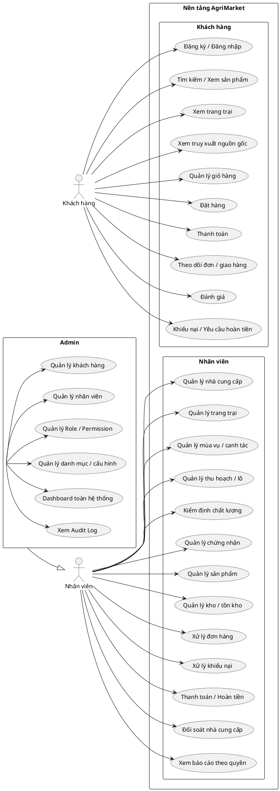

# 7. BIỂU ĐỒ USE CASE – KHÁCH HÀNG

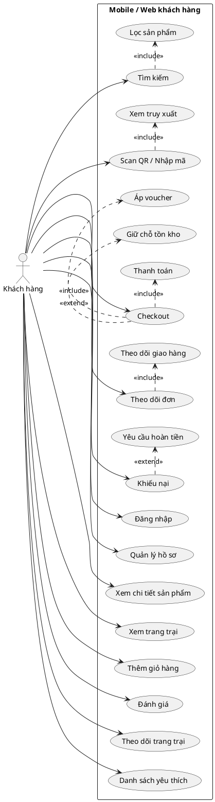

---

# 8. BIỂU ĐỒ LỚP – MIỀN NGHIỆP VỤ CỐT LÕI

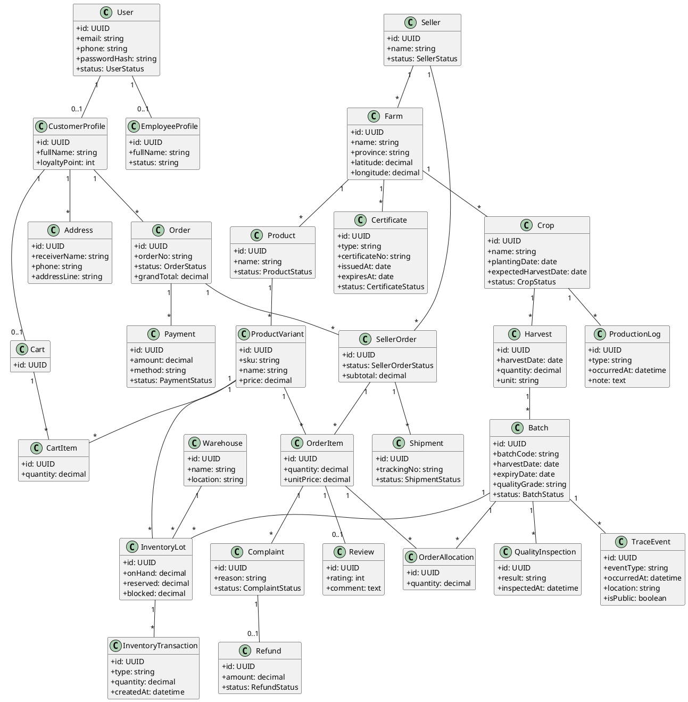

---

# 9. GIẢI THÍCH BIỂU ĐỒ LỚP

## 9.1. Product và Batch phải tách riêng

```text
Product = sản phẩm trên catalog
Batch = lô vật lý có nguồn gốc cụ thể
```

## 9.2. InventoryLot là tồn kho theo lô

Không dùng `Product.stock` làm nguồn sự thật duy nhất.

```text
Warehouse + Batch + ProductVariant = InventoryLot
```

## 9.3. OrderAllocation là liên kết truy xuất quan trọng

Nó trả lời câu hỏi một `OrderItem` được fulfil từ batch nào.

---

# 10. BIỂU ĐỒ TRẠNG THÁI – ĐƠN HÀNG

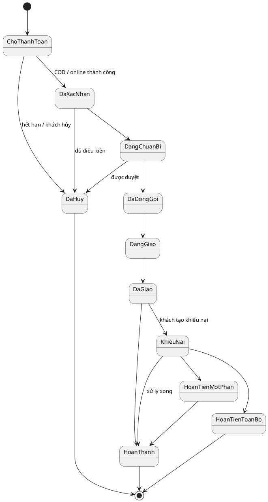

---

# 11. BIỂU ĐỒ TRẠNG THÁI – LÔ SẢN PHẨM

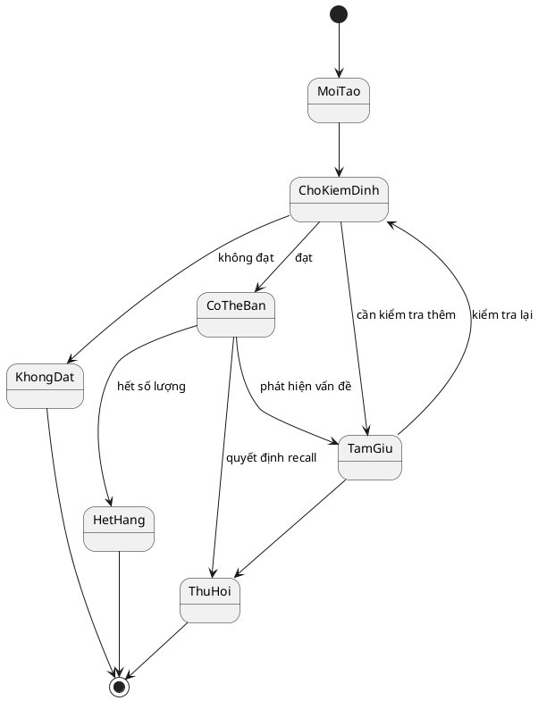

---

# 12. BIỂU ĐỒ TRẠNG THÁI – CHỨNG NHẬN

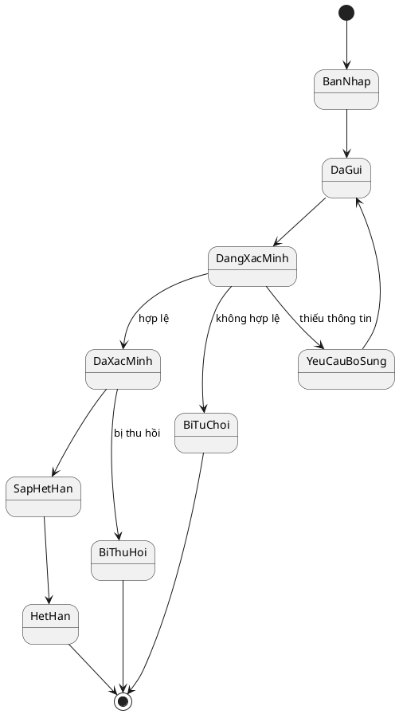

---

# 13. BIỂU ĐỒ TRẠNG THÁI – NHÀ CUNG CẤP

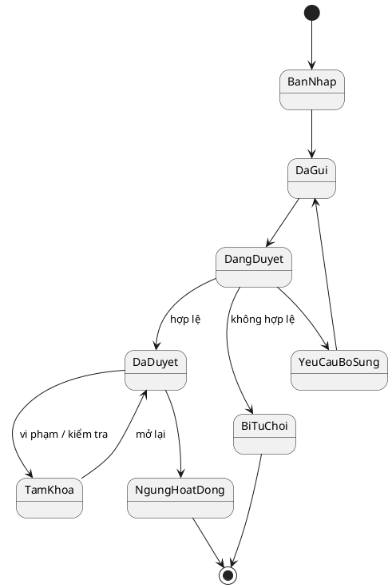

---

# 14. BIỂU ĐỒ TRẠNG THÁI – THANH TOÁN

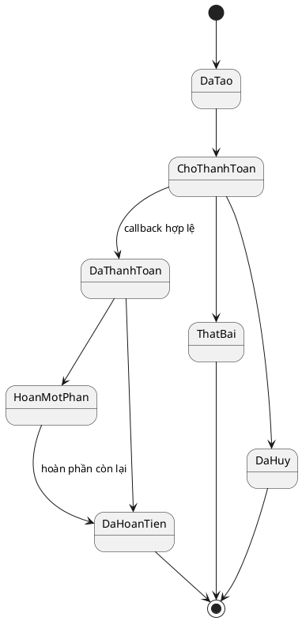

---

# 15. BIỂU ĐỒ HOẠT ĐỘNG – KHÁCH MUA HÀNG

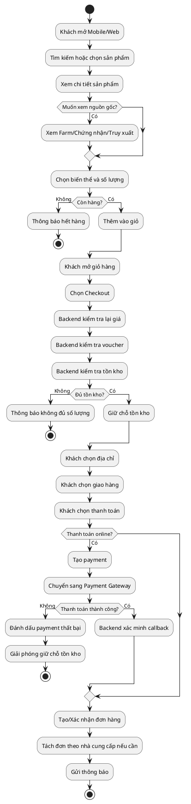

---

# 16. BIỂU ĐỒ HOẠT ĐỘNG – XỬ LÝ ĐƠN HÀNG

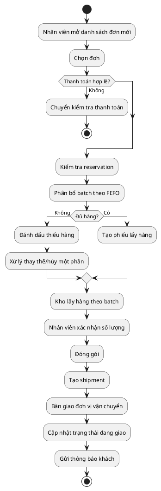

---

# 17. BIỂU ĐỒ HOẠT ĐỘNG – SCAN QR VÀ TRUY XUẤT

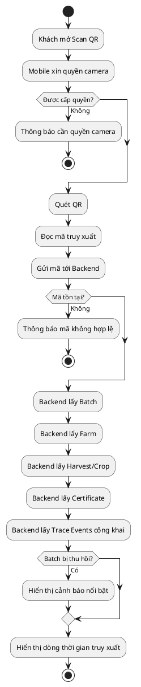

---


# 18. BIỂU ĐỒ HOẠT ĐỘNG – TẠO VÀ DUYỆT HỒ SƠ NHÀ CUNG CẤP

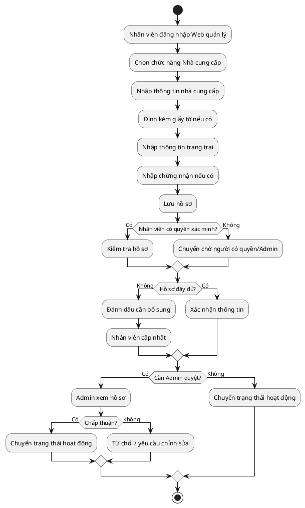

# 19. BIỂU ĐỒ HOẠT ĐỘNG – KHIẾU NẠI VÀ HOÀN TIỀN

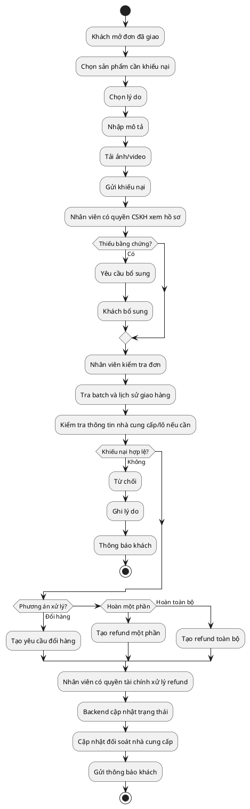

---

# 20. BIỂU ĐỒ HOẠT ĐỘNG – TẠO LÔ TỪ MÙA VỤ

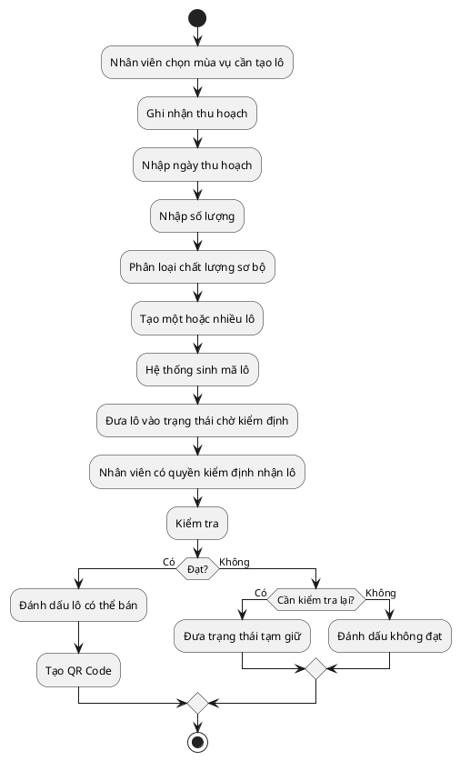

---

# 21. BIỂU ĐỒ HOẠT ĐỘNG – TỒN KHO VÀ FEFO

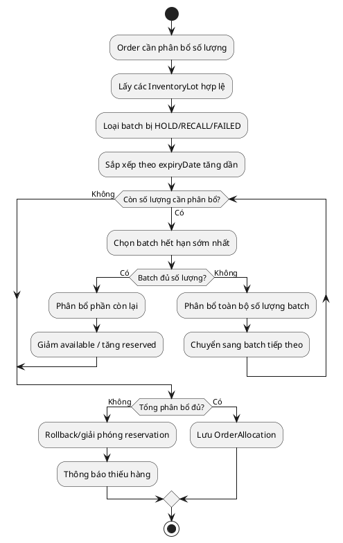

---


# 22. MA TRẬN ACTOR – CHỨC NĂNG

| Chức năng | Khách hàng | Nhân viên | Admin |
|---|---:|---:|---:|
| Đăng ký/đăng nhập | ✓ | ✓ | ✓ |
| Tìm kiếm/xem sản phẩm | ✓ | ✓ | ✓ |
| Xem trang trại | ✓ | ✓ | ✓ |
| Scan QR/xem truy xuất | ✓ | ✓ | ✓ |
| Giỏ hàng/đặt hàng | ✓ |  |  |
| Thanh toán | ✓ | xử lý theo quyền | ✓ |
| Theo dõi đơn | ✓ | ✓ theo quyền | ✓ |
| Đánh giá | ✓ | xem/quản lý theo quyền | ✓ |
| Tạo khiếu nại | ✓ |  |  |
| Xử lý khiếu nại |  | ✓ theo quyền | ✓ |
| Quản lý nhà cung cấp |  | ✓ theo quyền | ✓ |
| Quản lý trang trại |  | ✓ theo quyền | ✓ |
| Quản lý mùa vụ |  | ✓ theo quyền | ✓ |
| Quản lý lô |  | ✓ theo quyền | ✓ |
| Kiểm định |  | ✓ theo quyền | ✓ |
| Chứng nhận | xem | ✓ theo quyền | ✓ |
| Quản lý sản phẩm |  | ✓ theo quyền | ✓ |
| Kho/tồn kho |  | ✓ theo quyền | ✓ |
| Xử lý đơn | xem trạng thái | ✓ theo quyền | ✓ |
| Hoàn tiền | nhận kết quả | ✓ theo quyền | ✓ |
| Hoa hồng/đối soát |  | ✓ theo quyền | ✓ |
| Dashboard nghiệp vụ |  | ✓ theo quyền | ✓ |
| Quản lý khách hàng |  |  | ✓ |
| Quản lý nhân viên |  |  | ✓ |
| Role/Permission |  |  | ✓ |
| Cấu hình hệ thống |  |  | ✓ |
| Audit Log toàn hệ thống |  | giới hạn | ✓ |


# 23. DANH SÁCH USE CASE CẦN ĐẶC TẢ CHI TIẾT Ở BƯỚC TIẾP THEO

## 23.1. Use Case của Khách hàng

```text
UC-01 Đăng ký tài khoản
UC-02 Đăng nhập
UC-03 Quản lý hồ sơ/địa chỉ
UC-04 Tìm kiếm và lọc sản phẩm
UC-05 Xem chi tiết sản phẩm
UC-06 Xem trang trại
UC-07 Scan QR / Nhập mã truy xuất
UC-08 Xem truy xuất nguồn gốc
UC-09 Quản lý giỏ hàng
UC-10 Checkout
UC-11 Thanh toán
UC-12 Theo dõi đơn hàng
UC-13 Hủy đơn
UC-14 Đánh giá sản phẩm
UC-15 Gửi khiếu nại
UC-16 Yêu cầu hoàn tiền
UC-17 Theo dõi trang trại / sản phẩm yêu thích
```

## 23.2. Use Case của Nhân viên

Các Use Case chỉ được sử dụng nếu Nhân viên có Permission tương ứng.

```text
UC-18 Quản lý hồ sơ nhà cung cấp
UC-19 Quản lý trang trại
UC-20 Quản lý mùa vụ
UC-21 Ghi nhật ký canh tác
UC-22 Ghi nhận thu hoạch
UC-23 Tạo/quản lý lô sản phẩm
UC-24 Kiểm định lô
UC-25 Quản lý/xác minh chứng nhận
UC-26 Quản lý sản phẩm
UC-27 Nhập kho
UC-28 Xuất/chuyển/điều chỉnh tồn kho
UC-29 Phân bổ lô theo FEFO
UC-30 Xử lý đơn hàng
UC-31 Đóng gói và bàn giao vận chuyển
UC-32 Xử lý khiếu nại
UC-33 Xử lý hoàn tiền
UC-34 Đối soát nhà cung cấp
UC-35 Ghi nhận chi trả nhà cung cấp
UC-36 Xem báo cáo theo quyền
UC-37 Thu hồi lô theo quyền
```

## 23.3. Use Case của Admin

```text
UC-38 Quản lý khách hàng
UC-39 Quản lý nhân viên
UC-40 Khóa/mở khóa tài khoản
UC-41 Quản lý Role
UC-42 Quản lý Permission
UC-43 Gán quyền cho nhân viên
UC-44 Quản lý danh mục
UC-45 Cấu hình hoa hồng
UC-46 Cấu hình khuyến mãi
UC-47 Dashboard toàn hệ thống
UC-48 Xem Audit Log
UC-49 Cấu hình hệ thống
```

Mỗi Use Case chi tiết nên có:

```text
Mã Use Case
Tên Use Case
Mục tiêu
Actor chính
Điều kiện trước
Trigger
Luồng chính
Luồng thay thế
Luồng ngoại lệ
Điều kiện sau
Quy tắc nghiệp vụ
Dữ liệu đầu vào
Dữ liệu đầu ra
API liên quan
Bảng dữ liệu liên quan
```

# 24. KẾT LUẬN PHẦN PHÂN TÍCH YÊU CẦU

Bộ phân tích này xác định hệ thống có đúng 03 Actor chính: **Khách hàng – Nhân viên – Admin**, đồng thời hệ thống không phải một ứng dụng bán hàng đơn giản.

Ba nhóm nghiệp vụ tạo chiều sâu chính là:

```text
1. Marketplace nhiều nhà cung cấp
2. Quản lý nông sản theo lô + FEFO
3. Truy xuất nguồn gốc từ khách hàng ngược về trang trại
```

Kiến trúc nghiệp vụ cốt lõi:

```text
Customer
   ↓
Product
   ↓
OrderItem
   ↓
OrderAllocation
   ↓
Batch
   ↓
Harvest
   ↓
Crop
   ↓
Farm
```

Đây cũng nên là trục chính khi thiết kế Database, API, Class Diagram, Use Case, Activity Diagram, State Diagram và Testing ở các bước tiếp theo.
