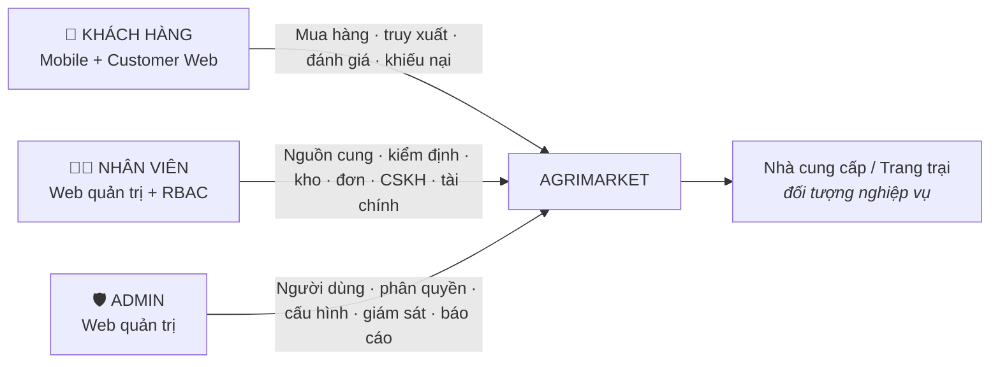
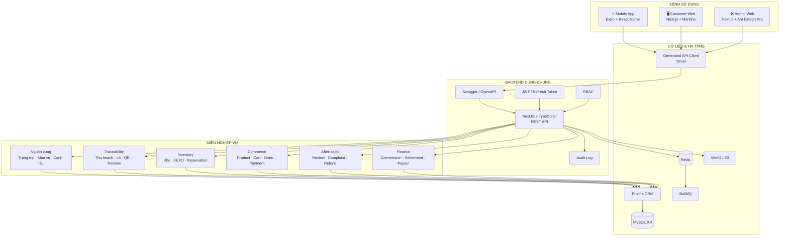
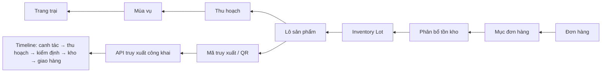
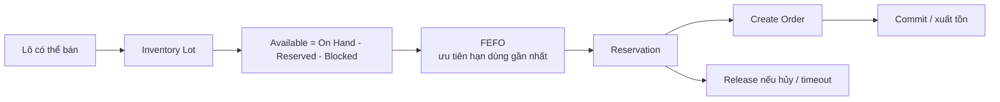
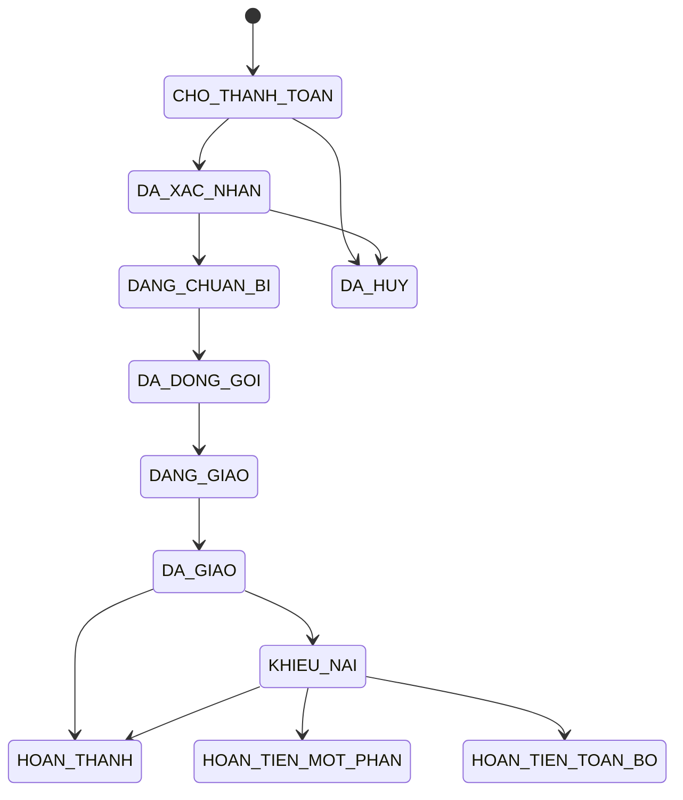
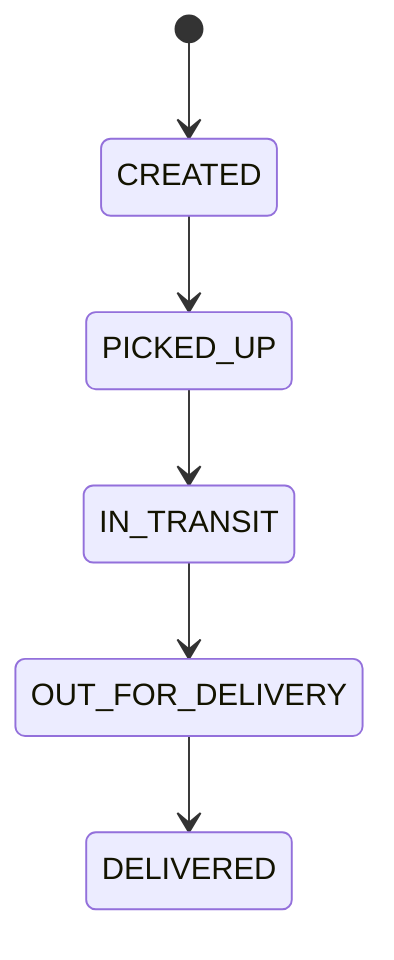
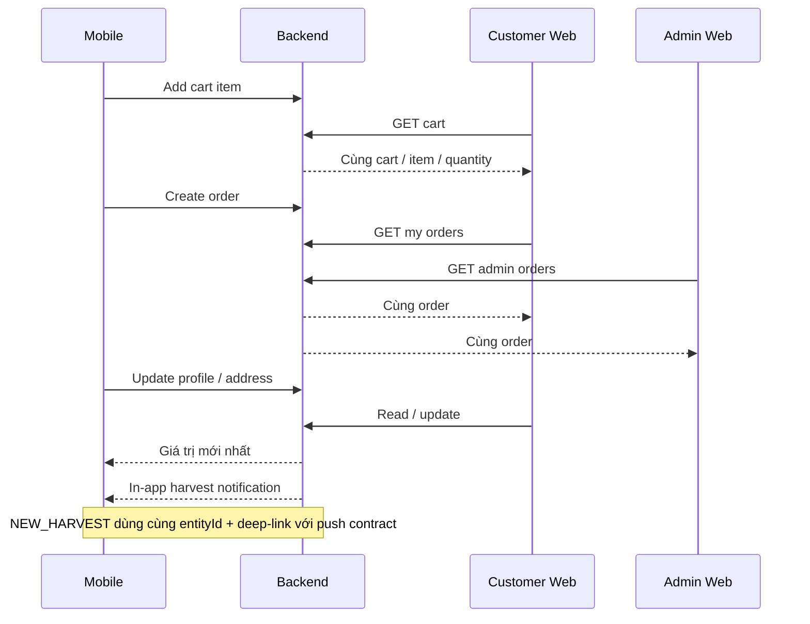

<div align="center">

# 🌿 AgriMarket

### Nền tảng bán nông sản đa nền tảng tích hợp truy xuất nguồn gốc

**Mobile khách hàng · Web khách hàng · Web quản trị · Backend dùng chung**

`Traceability` · `E-commerce` · `Inventory` · `Order` · `Finance` · `RBAC` · `Audit`

</div>

---

## 1. AgriMarket giải quyết bài toán gì?

AgriMarket là nền tảng quản lý và bán nông sản theo chuỗi xuyên suốt **từ nguồn cung đến người tiêu dùng**. Hệ thống không chỉ xử lý thương mại điện tử mà còn lưu lại dữ liệu nguồn gốc để mỗi sản phẩm có thể truy ngược về lô hàng, thu hoạch, mùa vụ và trang trại.

```text
Nhà cung cấp
→ Trang trại
→ Mùa vụ / Nhật ký canh tác
→ Thu hoạch
→ Kiểm định / Chứng nhận
→ Lô sản phẩm
→ Kho / Tồn kho
→ Sản phẩm
→ Giỏ hàng
→ Đơn hàng / Thanh toán / Giao hàng
→ Khách hàng
→ Đánh giá / Khiếu nại / Hoàn tiền
→ Đối soát / Chi trả / Báo cáo
```

### Giá trị chính

| Giá trị | Ý nghĩa |
|---|---|
| 🌱 **Minh bạch nguồn gốc** | Theo dõi hành trình nông sản từ trang trại đến sản phẩm được bán |
| 🛒 **Thương mại đa nền tảng** | Cùng tài khoản và dữ liệu trên Mobile + Customer Web |
| 📦 **Tồn kho theo lô** | Quản lý Inventory Lot, reservation, FEFO và giao dịch tồn kho |
| 🔐 **Vận hành có kiểm soát** | JWT, RBAC, Audit Log, phân quyền nhân viên |
| 💰 **Tài chính hậu mãi** | Refund, commission, settlement, payout |
| 📊 **Dữ liệu quản trị** | Dashboard và các báo cáo đơn hàng, tồn kho, truy xuất |

---

## 2. Actor nghiệp vụ

> Hệ thống chốt **đúng 03 Actor nghiệp vụ chính**. Nhà cung cấp / Trang trại là **đối tượng nghiệp vụ**, không phải Actor đăng nhập trong phạm vi đồ án hiện tại.



| Actor | Kênh | Nghiệp vụ chính |
|---|---|---|
| **Khách hàng** | Mobile, Customer Web | Khám phá sản phẩm, QR trace, cart, checkout, order, wishlist, follow farm, review, complaint |
| **Nhân viên** | Admin Web | Quản lý nguồn cung, mùa vụ, thu hoạch, kiểm định, kho, đơn hàng, CSKH, tài chính theo permission |
| **Admin** | Admin Web | Quản lý nhân viên, RBAC, audit, cấu hình hệ thống, dashboard và báo cáo |

---

## 3. Kiến trúc tổng thể



### Stack công nghệ

| Khu vực | Công nghệ |
|---|---|
| **Mobile** | Expo, React Native, TypeScript, Expo Router, gluestack-ui, UniWind, TanStack Query, Zustand |
| **Customer Web** | Next.js, React, TypeScript, Mantine, TanStack Query, Zustand |
| **Admin Web** | Next.js, React, TypeScript, Ant Design, ProComponents, TanStack Query |
| **Backend** | Node.js 24 LTS, NestJS, TypeScript |
| **Database** | MySQL 8.4 LTS, Prisma |
| **API** | REST, Swagger/OpenAPI, Orval Generated Client |
| **Cache / Queue** | Redis, BullMQ |
| **File** | MinIO / S3 |
| **Auth** | JWT, Refresh Token, RBAC |
| **Test** | Jest, Supertest, Vitest, RTL, Playwright |
| **DevOps** | Docker, Docker Compose, GitHub Actions |

---

## 4. Luồng nghiệp vụ end-to-end

```mermaid
flowchart LR
    A["Nhà cung cấp"] --> B["Trang trại"]
    B --> C["Mùa vụ"]
    C --> D["Nhật ký canh tác"]
    D --> E["Thu hoạch"]
    E --> F["Kiểm định chất lượng"]
    F --> G["Chứng nhận"]
    G --> H["Lô sản phẩm"]
    H --> I["QR / Trace Events"]
    H --> J["Nhập kho"]
    J --> K["Inventory Lot"]
    K --> L["Sản phẩm công khai"]
    L --> M["Tìm kiếm / Lọc"]
    M --> N["Giỏ hàng"]
    N --> O["Checkout Preview"]
    O --> P["Reservation / FEFO"]
    P --> Q["Đơn hàng"]
    Q --> R["Thanh toán"]
    R --> S["Đóng gói"]
    S --> T["Vận chuyển"]
    T --> U["Giao hàng"]
    U --> V["Đánh giá"]
    U --> W["Khiếu nại"]
    W --> X["Hoàn tiền"]
    U --> Y["Commission"]
    Y --> Z["Settlement"]
    Z --> AA["Payout"]
    Q --> AB["Dashboard / Báo cáo"]
    K --> AB
    I --> AB
```



---

## 5. Truy xuất nguồn gốc

Một mục đơn hàng không chỉ lưu tên sản phẩm. Hệ thống giữ quan hệ phân bổ tồn kho theo lô để truy ngược nguồn gốc thực tế của hàng đã bán.



Khách hàng có thể:

- **Mobile:** quét QR bằng camera;
- **Web:** nhập mã truy xuất;
- xem nguồn gốc, trang trại, mùa vụ, thu hoạch, kiểm định, chứng nhận và timeline;
- nhận cảnh báo khi lô bị **thu hồi**.

---

## 6. Tồn kho, FEFO và Reservation



Các nghiệp vụ kho đã có:

- nhập kho;
- xuất kho;
- chuyển kho atomic;
- điều chỉnh tồn kho có Audit;
- inventory transaction ledger;
- FEFO;
- reservation;
- cảnh báo gần hết hạn / hết hạn.

---

## 7. Vòng đời đơn hàng



### Vận chuyển



---

## 8. Đồng bộ đa nền tảng

Backend là **nguồn sự thật dùng chung**, vì vậy Mobile và Web không có cart/order/profile độc lập.



### Các sync contract đã khóa bằng E2E

| Sync | Contract |
|---|---|
| **Cart** | Mobile add → Customer Web thấy cùng cart/item |
| **Order** | Mobile tạo → Customer Web thấy → Admin thấy |
| **Profile / Address** | Mobile update → Web thấy và chiều ngược lại |
| **Notification** | In-app new harvest → cùng `NEW_HARVEST` push payload/deep-link |

> Push client dùng Expo Notifications. Server-side device-token registration / delivery producer chỉ được coi là production-ready khi có contract Backend tương ứng; README không giả định phần chưa tồn tại.

---

## 9. Các phân hệ chính

| Nhóm | Module tiêu biểu |
|---|---|
| **Identity & Security** | Auth, Refresh Token, RBAC, Permission Matrix, Audit Log |
| **Supply** | Nhà cung cấp, Trang trại, Chứng nhận |
| **Production** | Mùa vụ, Nhật ký canh tác, Thu hoạch |
| **Traceability** | Lô sản phẩm, QR Code, Trace Events, Public Trace, Recall |
| **Catalog** | Danh mục, Sản phẩm, Biến thể, Giá, Ảnh |
| **Inventory** | Kho, Inventory Lot, Transaction Ledger, FEFO, Reservation |
| **Commerce** | Cart, Checkout Preview, Order, Payment, COD, Gateway Adapter |
| **Fulfillment** | Packing, Shipment, Shipping Adapter |
| **Customer** | Profile, Address, Wishlist, Follow Farm, Loyalty, Voucher |
| **After-sales** | Review, Complaint, Refund |
| **Finance** | Commission, Seller Balance, Settlement, Payout |
| **Analytics** | Dashboard, Inventory Report, Order/Revenue Report, Traceability Report |

---

### 🔎 Tối ưu tìm kiếm MySQL · PHIEN-111

Public product search giữ nguyên hành vi tìm substring hiện tại, đồng thời bổ sung index ở lớp MySQL cho đường query nền:

```text
idx_san_pham_trang_thai_ten_created_at
(trang_thai, ten, created_at)
```

`EXPLAIN` được dùng để kiểm tra MySQL có thể tận dụng composite index cho danh sách sản phẩm công khai theo trạng thái và thứ tự `ten → created_at`.

> **FULLTEXT chưa được bật ở PHIEN-111** vì endpoint hiện dùng substring `contains`. Việc chuyển sang relevance/scoring được tách sang **PHIEN-112 – Search Ranking** để không âm thầm thay đổi semantics tìm kiếm.

---

## 10. Cấu trúc Monorepo

```text
AgriMarket/
├── apps/
│   ├── api/            # NestJS Backend
│   ├── customer-web/   # Next.js + Mantine
│   ├── admin-web/      # Next.js + Ant Design Pro
│   └── mobile/         # Expo + React Native
├── packages/
│   └── api-client/     # Generated REST client từ OpenAPI
├── docs/               # Source-of-truth & nhật ký dự án
├── infra/
├── docker-compose.yml
├── pnpm-workspace.yaml
└── package.json
```

---

## 11. Chạy dự án

### Yêu cầu

- Node.js 24 LTS
- pnpm
- Docker + Docker Compose

### Hạ tầng local

```bash
docker compose up -d
docker compose ps
```

### Cài dependency

```bash
pnpm install
```

### Backend

```bash
pnpm --filter @agrimarket/api start:dev
```

- API: `http://localhost:3000/api/v1`
- Swagger: `http://localhost:3000/docs`

### Customer Web

```bash
pnpm --filter @agrimarket/customer-web dev
```

### Admin Web

```bash
pnpm --filter @agrimarket/admin-web dev
```

### Mobile

```bash
pnpm --filter @agrimarket/mobile start
```

### Quality gates

```bash
pnpm lint
pnpm typecheck
pnpm test
pnpm build
pnpm format:check
```

---

## 12. Nguyên tắc kiến trúc

- **Modular Monolith**, không tự chuyển sang Microservices.
- **MySQL + Prisma** là lớp dữ liệu chính.
- **REST + Swagger/OpenAPI**, không GraphQL.
- Frontend gọi API qua **generated client**.
- Backend là nguồn sự thật của **giá, tồn kho, FEFO, reservation, thanh toán**.
- Chỉ có **03 Actor nghiệp vụ**: Khách hàng, Nhân viên, Admin.
- Nhân viên được chia quyền bằng **RBAC**, không tách mỗi chức danh thành Actor.
- Code nghiệp vụ dùng **tiếng Việt không dấu**; UI/comment/docs dùng **tiếng Việt có dấu**.

---

## 13. Tài liệu quan trọng

- [`docs/TRANG_THAI_DU_AN.md`](./docs/TRANG_THAI_DU_AN.md) — trạng thái mới nhất.
- [`docs/BOI_CANH_DU_AN_CHO_GPT.md`](./docs/BOI_CANH_DU_AN_CHO_GPT.md) — snapshot repository cho AI/coding agent.
- [`docs/KE_HOACH_CAC_PHIEN_AI.md`](./docs/KE_HOACH_CAC_PHIEN_AI.md) — master các phiên.
- [`Dac_ta_yeu_cau_va_UML_AgriMarket_3_Actor (1).md`](./Dac_ta_yeu_cau_va_UML_AgriMarket_3_Actor%20%281%29.md) — đặc tả yêu cầu và UML.
- [`Phan_tich_cong_nghe_AgriMarket_UI_hien_dai.md`](./Phan_tich_cong_nghe_AgriMarket_UI_hien_dai.md) — stack và kiến trúc.
- [`README_TU_DONG_HOA_GITHUB.md`](./README_TU_DONG_HOA_GITHUB.md) — hướng dẫn automation GitHub.

---

## 14. Tiến độ

**Đã hoàn thành tới PHIEN-111 – MySQL Search Optimization.**

Phiên tiếp theo:

```text
PHIEN-112 – Search Ranking
```

---

<div align="center">

### 🌾 Từ nông trại đến bàn ăn — minh bạch trong từng bước

**AgriMarket · Công nghệ kết nối nông sản Việt**

</div>
