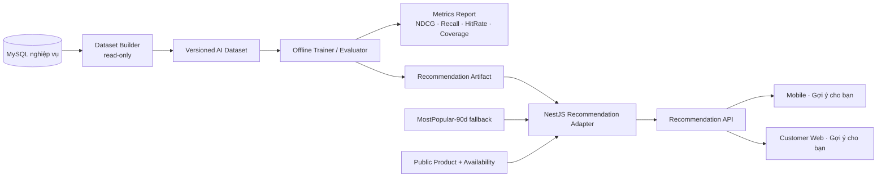

# PHIEN-113 – AI Module: Recommendation System

## 1. Quyết định

AgriMarket chọn **Recommendation System** làm AI module chính.

Exact master cho phép chọn một trong:

```text
Recommendation System
Semantic Search
Demand Forecast
Computer Vision Quality
```

PHIEN-113 chỉ **chốt bài toán và thiết kế**. Không train model, không thêm API AI, không sửa schema và không thêm dependency.

### Vì sao chọn Recommendation System?

Repository hiện đã có các tín hiệu người dùng – sản phẩm đủ tốt để bắt đầu recommendation mà không phải bịa dữ liệu:

- `DonHang` gắn trực tiếp với `khachHangId`;
- `MucDonHang` giữ `sanPhamId`, category snapshot và farm snapshot;
- `SanPhamYeuThich` biểu diễn wishlist;
- `DanhGia` biểu diễn explicit rating trên order item;
- `TheoDoiTrangTrai` biểu diễn farm affinity;
- `SanPham` có category + farm metadata;
- Inventory cho phép lọc sản phẩm còn khả dụng trước khi trả recommendation.

Ba phương án còn lại chưa được chọn ở giai đoạn này:

| Module | Lý do chưa chọn làm module chính |
|---|---|
| Semantic Search | Search hiện đã có MySQL optimization + rule-based ranking; semantic embeddings sẽ thêm model/index/vector infrastructure mới |
| Demand Forecast | Cần lịch sử nhu cầu đủ dài và ổn định; coursework repo hiện chưa có production history đủ để đánh giá đáng tin |
| Computer Vision Quality | Cần image dataset + label + training pipeline riêng, không tận dụng trực tiếp transaction/customer signals đang có |
| Recommendation System | **Được chọn** vì tận dụng trực tiếp dữ liệu nghiệp vụ hiện hữu và dễ chứng minh bằng offline ranking metrics |

> Không loại bỏ vĩnh viễn ba module còn lại. Chỉ không làm song song để tránh vượt phạm vi master.

---

## 2. Problem

### Bài toán

Với một khách hàng `u`, từ catalog các sản phẩm công khai và còn khả dụng, trả về danh sách **Top-N sản phẩm phù hợp nhất** dựa trên lịch sử tương tác của khách hàng và metadata sản phẩm.

Mục tiêu phiên AI:

```text
customer history
      +
product metadata
      +
availability guard
      ↓
Top-N personalized recommendations
```

### Điểm tích hợp dự kiến

Ưu tiên đầu tiên:

1. Mobile Home – `Gợi ý cho bạn`;
2. Customer Web Home – `Gợi ý cho bạn`.

Có thể mở rộng sau:

- product detail – sản phẩm tương tự;
- cart – gợi ý bổ sung;
- follow-farm – ưu tiên sản phẩm mới từ farm đang theo dõi.

### Không được ảnh hưởng core commerce

Recommendation chỉ là **advisory**:

- không quyết định giá;
- không quyết định tồn kho;
- không can thiệp FEFO/reservation;
- không tự thay đổi cart/order;
- không làm checkout phụ thuộc AI.

Nếu AI không sẵn sàng, hệ thống vẫn hoạt động bình thường bằng fallback.

---

## 3. Dataset

### 3.1. Nguồn dữ liệu hiện có

#### Implicit / explicit interaction

| Nguồn | Event | Ý nghĩa |
|---|---|---|
| `DonHang` + `MucDonHang` | `PURCHASE` | Tín hiệu mạnh nhất: khách đã mua sản phẩm |
| `SanPhamYeuThich` | `WISHLIST` | Khách thể hiện quan tâm |
| `DanhGia` | `RATING` | Explicit feedback 1–5 sao |
| `TheoDoiTrangTrai` | `FOLLOW_FARM` | Affinity với trang trại |

#### Product features

| Nguồn | Feature |
|---|---|
| `SanPham` | product id, category, farm |
| `DanhMucSanPham` | category |
| `TrangTrai` | farm |
| `BienTheSanPham` | variant / price range |
| `TonKhoLo` | availability guard |

### 3.2. Canonical interaction dataset

PHIEN-114 sẽ materialize dataset theo schema logic:

```text
customer_id
product_id
event_type
event_value
event_time
category_id
farm_id
```

Quy tắc:

- `PURCHASE`: một row cho product đã mua;
- `WISHLIST`: một row khi khách thêm yêu thích;
- `RATING`: giữ raw rating 1–5, chưa ép thành implicit weight tại PHIEN-113;
- `FOLLOW_FARM`: giữ farm affinity, không giả thành direct product click.

### 3.3. Product feature dataset

```text
product_id
category_id
farm_id
is_active
is_available
price_min
price_max
```

### 3.4. Dữ liệu KHÔNG tồn tại hiện tại

Repository chưa có event table chuẩn cho:

```text
impression
product_view
click
search_click
recommendation_impression
recommendation_click
```

Vì vậy:

- chưa dùng CTR/AUC làm metric chính;
- không tuyên bố có negative feedback từ impression;
- không bịa page-view/click history.

Nếu cần online evaluation sau này, phải thêm event tracking ở một phiên riêng.

### 3.5. Privacy

Dataset AI không cần:

```text
email
số điện thoại
họ tên
địa chỉ
```

Chỉ dùng stable internal identifiers / pseudonymous IDs cùng interaction/product features.

### 3.6. Split

Offline evaluation phải **chronological**, không random split làm rò tương lai.

Ưu tiên:

```text
train      = tương tác cũ
validation = tương tác kế tiếp
test       = tương tác mới nhất
```

Với user đủ lịch sử, dùng leave-last-out / time-based holdout.

User không đủ lịch sử được đưa vào nhóm **cold-start**, không ép vào personalized evaluation.

---

## 4. Baseline

PHIEN-115 sẽ implement baseline đầu tiên:

# MostPopular-90d

```text
completed/delivered purchases
      ↓
count by product
      ↓
last 90 days
      ↓
filter active + available
      ↓
Top-N
```

Baseline phải:

- deterministic;
- không cần user profile;
- phục vụ được cold-start;
- là mốc tối thiểu để recommendation model phải vượt qua.

Tie-break dự kiến:

```text
purchase_count DESC
rating_avg DESC
product_id ASC
```

### Candidate sau baseline

Ứng viên personalized model:

```text
Hybrid implicit recommender
= collaborative signal
+ category affinity
+ farm affinity
```

Không khóa thư viện/model implementation ở PHIEN-113. PHIEN-115 chỉ được chọn model/dependency sau khi dataset PHIEN-114 đã có statistics thật.

---

## 5. Metrics

### Primary

```text
NDCG@10
```

Lý do: không chỉ đo có hit hay không mà còn thưởng khi item liên quan nằm ở vị trí cao.

### Secondary

```text
Recall@10
HitRate@10
CatalogCoverage@10
```

### Serving guardrails

```text
duplicate_rate = 0
inactive_product_rate = 0
unavailable_product_rate = 0
```

### Cold-start

Fallback phải trả được danh sách hợp lệ khi:

- khách mới;
- khách chưa có interaction;
- model artifact chưa tồn tại;
- model bị lỗi.

### Điều kiện để candidate được tích hợp

Candidate model chỉ được coi là tốt hơn baseline nếu trên cùng chronological test set:

```text
NDCG@10 > MostPopular-90d
Recall@10 không giảm
guardrails = PASS
```

Mục tiêu cải thiện ban đầu:

```text
NDCG@10 >= baseline × 1.05
```

Đây là **relative target**, không bịa absolute score khi dataset thực chưa được build.

---

## 6. Architecture

### 6.1. Nguyên tắc

- AI là optional capability.
- Core commerce không phụ thuộc AI.
- Không biến Modular Monolith thành microservices chỉ để có AI.
- Training/evaluation chạy offline.
- Runtime integration đi qua một Recommendation Adapter nhỏ ở Backend.
- Luôn có deterministic fallback.

### 6.2. Kiến trúc dự kiến



### 6.3. Failure boundary

```text
AI artifact available
    → personalized Top-N

AI artifact missing / invalid / timeout
    → MostPopular-90d

fallback failure
    → empty recommendation section
    → core application vẫn chạy
```

Không được:

```text
AI lỗi → checkout lỗi
AI lỗi → order lỗi
AI lỗi → inventory lỗi
```

---

## 7. Integration Plan

### PHIEN-114 – Chuẩn bị dữ liệu AI

Deliverable:

```text
dataset builder
interaction schema
product feature schema
dataset statistics
chronological split
deterministic evaluation fixture
```

Không train model ở PHIEN-114.

### PHIEN-115 – Baseline AI

Deliverable:

```text
MostPopular-90d baseline
candidate personalized recommender
offline evaluator
NDCG@10
Recall@10
HitRate@10
CatalogCoverage@10
comparison report
```

Chỉ candidate vượt baseline mới được đề xuất tích hợp.

### PHIEN-116 – Tích hợp API AI

Deliverable dự kiến:

```text
Recommendation Adapter
GET recommendation endpoint
availability guard
fallback
Mobile/Web "Gợi ý cho bạn"
```

Core commerce không gọi AI như dependency bắt buộc.

---

## 8. Acceptance PHIEN-113

PHIEN-113 hoàn thành khi:

- [x] chọn đúng một AI module chính: Recommendation System;
- [x] problem rõ ràng;
- [x] dataset map vào schema thật;
- [x] baseline rõ ràng;
- [x] metrics có thể đo offline;
- [x] architecture giữ core độc lập AI;
- [x] integration plan map PHIEN-114/115/116;
- [x] không train/model/API/schema/dependency trong phiên này.

---

## 9. Boundary sang PHIEN-114

PHIEN-114 mới được:

- tạo dataset builder;
- materialize interaction/product dataset;
- thống kê sparsity;
- tạo chronological split;
- tạo deterministic evaluation fixture.

PHIEN-113 **không** tự làm trước các bước trên.

---

## 10. PHIEN-114 – Dataset Preparation

PHIEN-114 materialize đúng dataset contract đã chốt ở PHIEN-113. Đây vẫn là **offline/read-only AI preparation**, chưa train model và chưa có Recommendation API.

### 10.1. Dataset builder

Implementation:

```text
apps/api/src/ai/recommendation/bo-du-lieu-recommendation.ts
```

Output logic:

```text
RecommendationDataset
├── tuongTac[]
│   ├── PURCHASE
│   ├── WISHLIST
│   ├── RATING
│   └── FOLLOW_FARM
├── sanPham[]
├── phanChia
│   ├── train
│   ├── validation
│   ├── test
│   ├── coldStart
│   └── auxiliary
└── thongKe
```

### 10.2. Interaction contract

```text
nguonId
khachHangId
sanPhamId | null
loai
giaTri
thoiGian
danhMucSanPhamId | null
trangTraiId | null
```

Mapping:
- `PURCHASE`: chỉ order `DA_GIAO` hoặc `HOAN_THANH`; `giaTri = soLuong`;
- `WISHLIST`: `giaTri = 1`;
- `RATING`: giữ raw `diem` 1–5;
- `FOLLOW_FARM`: `sanPhamId = null`, không giả follow-farm thành product click.

Dataset không lấy email, họ tên, số điện thoại hay địa chỉ.

### 10.3. Product feature contract

```text
sanPhamId
danhMucSanPhamId
trangTraiId
congKhai
khaDung
soLuongKhaDung
giaMin
giaMax
createdAt
```

`congKhai` giữ cùng rule với public catalog:

```text
product active
+ farm active
+ supplier active
+ category active
+ có variant
```

`khaDung` chỉ tính inventory lot:

```text
warehouse active
+ batch CO_THE_BAN
+ chưa hết hạn tại thoiDiemChot
+ onHand - reserved - blocked > 0
```

### 10.4. Chronological split

Chỉ direct product interactions (`PURCHASE`, `WISHLIST`, `RATING`) được dùng làm target.

Per customer:

```text
< 3 direct events
→ coldStart

>= 3 direct events
→ train      = tất cả trừ 2 event cuối
→ validation = event áp chót
→ test       = event cuối
```

`FOLLOW_FARM` nằm trong `auxiliary`; giữ timestamp để PHIEN-115 sử dụng như affinity feature mà không biến thành recommendation target.

### 10.5. Statistics

Builder trả customer/product/interactions/type counts/customer-product pairs/density/sparsity/evaluation users/cold-start/split sizes.

Không đặt absolute AI score ở PHIEN-114 vì chưa có baseline/model.

### 10.6. Determinism

- mọi interaction được sort theo time + customer + type + source id;
- product được sort theo product id;
- cùng `thoiDiemChot` + cùng DB snapshot phải tạo output giống nhau;
- test focused khóa determinism.

### 10.7. Validation

Focused test:

```text
apps/api/test/recommendation-dataset.e2e-spec.ts
```

Test dùng temporary current-schema MySQL DB và kiểm tra 4 interaction types, PII exclusion, public availability semantics, chronological split, cold-start, FOLLOW_FARM auxiliary và deterministic output.

DB dev không bị mutate.

---

## 11. Boundary sang PHIEN-115

PHIEN-115 mới được:

```text
MostPopular-90d baseline
candidate recommender
offline metrics
NDCG@10
Recall@10
HitRate@10
CatalogCoverage@10
```

PHIEN-114 không train model, không thêm model dependency và không tạo runtime Recommendation API.
