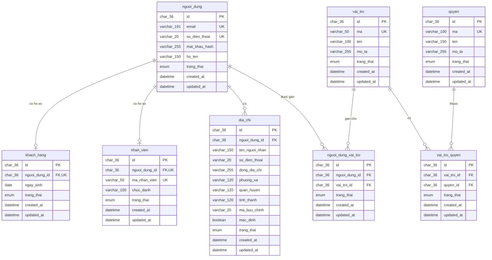

# ERD NỀN TẢNG – PHIEN-011

## Phạm vi

ERD này chỉ mô tả 8 bảng nền tảng của PHIEN-011. Chưa bao gồm các bảng
nghiệp vụ nhà cung cấp, trang trại, lô, sản phẩm, tồn kho, đơn hàng hay thanh toán.

## Quyết định

- ID dùng UUIDv7 do Prisma sinh, lưu `CHAR(36)` trên MySQL.
- Prisma Client dùng model/field tiếng Việt không dấu theo camelCase/PascalCase.
- Database dùng tên bảng/cột snake_case qua `@@map` và `@map`.
- `khach_hang` và `nhan_vien` là hồ sơ chuyên biệt 1-1 với `nguoi_dung`.
- `vai_tro_quyen` và `nguoi_dung_vai_tro` có UUID riêng và unique compound
  để vừa chống trùng vừa cho phép mở rộng trạng thái/audit về sau.
- `dia_chi` thuộc `nguoi_dung`; một người có thể có nhiều địa chỉ.
- PHIEN-011 chỉ tạo nền tảng dữ liệu. Logic Auth nằm ở PHIEN-012,
  PermissionGuard/RBAC nằm ở PHIEN-013.
